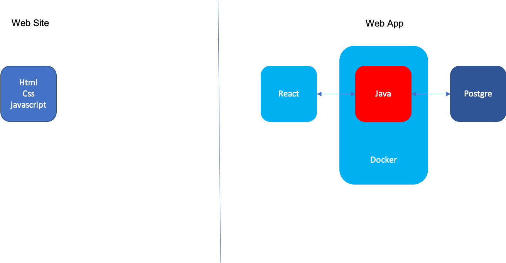

# UM Third-CC Official Site

This is a Web Site developed with html, css and javascript. To provide information regarding the University Malaya Third College Chinese Community activities.

This Web Site will provide a link to another Web Application to enable communications between friends and ease the management as well as planning process of Activities Organisers.

## Firebase Cloud Functions
~~~
cd functions
npm i
~~~

## Firebase Project
#### First Time Only
~~~
npm install -g firebase-tools
firebase login
~~~
#### Emulate using local HTTP functions before deploy
~~~
firebase serve
~~~
#### Depoly
~~~
firebase deploy
~~~
#### Optional Flag
~~~
--only hosting
--only functions
~~~

## System Architecture

### Web Page

Plain html, css and javascript

### Web Application

React.js front-end, with Java front-end

## Reminder
* Project setup:
  * Make sure you have node.js installed on your machine as we are using it as package manager
  * To install Bootstrap packages via npm, write the following in your terminal: 
    * npm -install
  * If you are using text-editor/ IDE of any kind, do include the editor/IDE's setting file/folder in the .gitignore file:
    * ie: .vscode/ for visual studio code
* Please strictly follow git work flow documented by Atlassian Bitbucket, for more info please visit this [Link](https://www.atlassian.com/git/tutorials/comparing-workflows/gitflow-workflow).

Documentation of functional and non-functional requirements should be listed in wiki